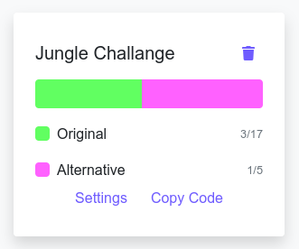

# Hapu Nanny Share - Jungle Devs React challenge

This project was developed as part of the hiring process for [Jungle devs](https://github.com/JungleDevs). The goal was to replicate [this design](https://www.figma.com/file/iBxoiuoSXy3SiOAnwXo2Np/Frontend-%E2%80%93-Challenge-1B?node-id=0%3A1) and apply the following concepts:

- JSX;
- Components, props and state;
- Lifecycle Methods;
- Responsive design with CSS media-queries;
- API calls;
- Error handling;
- Loading states;
- SEO & accessibility;
- A/B tests;
- Production builds.

bootstrapped with [Create React App](https://github.com/facebook/create-react-app).

# Development mode

In order to run the project in development mode, you can run:

#### `npm install`
#### `npm start`

It opens [http://localhost:3000](http://localhost:3000) to view it in the browser.

The page will reload if you make edits.\
You will also see any lint errors in the console.

# Production build

run `npm run build` to create the build folder. Also, the project is already deployed in Github Pages: guidugaich.github.io/jungle-challenge 

# Technologies used

This project uses React (with Hooks), and pure CSS with media queries. I also used a third-party service for AB testing, as described in the following section

# A/B Testing

For the A/B testing I used an external library called [react-lean-analytics](https://github.com/Hermanya/react-lean-analytics). It lets you build the UI with an `Experiment` component and several `Variant` components within it. Then it sends the data to a web service in https://leananalytics.io/lab/ and you can see the comparison:

 
 

 
 

The `Original` is the variant in the design version and the `Alternative` is the other one in the [challange's README.md](https://github.com/JungleDevs/react-challenge-001FT#acceptance-criteria). It compares the success cases (form was filled and sent) against the non-click cases (just a visit to the page). The service is free of charge and pretty simple to setup. I also researched other services that would be more suitable for production-ready applications, like [firebase](https://firebase.google.com/docs/ab-testing) and [optimizely](https://docs.developers.optimizely.com/full-stack/docs/run-a-b-tests). But for the purpose of this project, the one applied was simpler.

# Folder Structure

All components are in the `./src/components` folder, and the components themselves are folders that contain both an `index.jsx` and a `style.css` file.

# Testing

There are 2 test cases implemented, both related to the form. They check the email validation and if the correct API call was made after submitting. Tests can be checked with `npm run test` 
